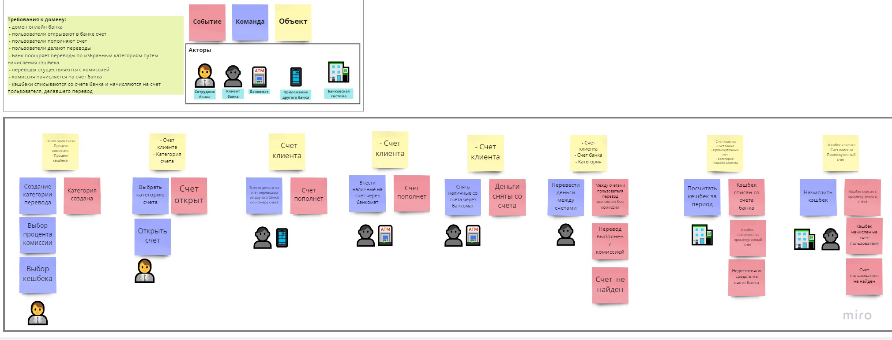

# Scala money

Выполнила:
студентка группы МИВТ-22-5
**Колезнева Надежда**

## В проекте реализовано

* Возможность пользователем открыть счет, пополнять его, выполнять переводы
* Переводы выполняются с комиссией после превышения лимита на переводы
* Банк продвигает кэшбэк-поощрения за переводы в рамках определенных категорий
* Комиссия начисляется на счет банка
* Когда пользователь совершает перевод, кэшбэки списываются с счета банка и добавляются к счету пользователя
* Система состоит из микросервисов: Счет, Операционный сервис, Кэшбек, Коммиссия
* Сервис счета запускается в нескольких репликах, при этом каждый реплик обслуживает свои счета
* Операционный сервис реализует взаимодействие с пользователем по rest api
* Сервисы взаимодействуют по средствам сообщений (команд и событий)
* Сообщения передаются через Apache Kafka

## Схема домена

